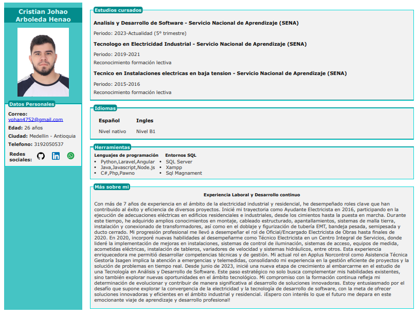

# Generar PDF de CV

Este repositorio contiene un script de Node.js que utiliza Puppeteer para generar una versión PDF de un currículum en formato HTML. El PDF se genera con dimensiones personalizadas e incluye colores de fondo e imágenes según lo definido en el archivo CSS.

## Vista Previa



## Requisitos previos

- **Node.js**: Asegúrate de tener Node.js instalado en tu máquina. Puedes descargarlo desde el [sitio web oficial de Node.js](https://nodejs.org/).

## Instalación

1. Clona este repositorio en tu máquina local:
   ```bash
   git clone https://github.com/cristianhar/Generar-pdf-cv.git


2. Navega al directorio del proyecto:
   ```bash
   cd Generar-pdf-cv

3. Instala los paquetes npm necesarios, incluyendo Puppeteer:
   ```bash
   npm install
   npm install puppeteer

## Uso
- Asegúrate de que tus archivos index.html y estilo.css estén configurados correctamente en la ubicación deseada.
- Edita la variable path en el script para apuntar a tu archivo index.html y especifica la ruta de salida deseada para el PDF. Por ejemplo:
  ```bash
  const filePath = path.resolve('C:/Users/evo_l/Desktop/CV/index.html');
  const fileUrl = `file://${filePath}`;
  const outputPdfPath = 'C:/Users/evo_l/Desktop/CV/resume.pdf';
- Ejecuta el script usando Node.js:
  ```bash
  node convertToPdf.js.js
- El PDF generado se guardará en la ubicación especificada.

  
## Personalización
- Ruta de salida del PDF: Puedes cambiar el valor de path en el método page.pdf para guardar el PDF con un nombre o ubicación diferente:
   ```bash
  path: 'C:/Users/evo_l/Desktop/CV/tu_nombre_personalizado.pdf'``
- Dimensiones: Ajusta el ancho y alto del PDF modificando las propiedades width y height en el método page.pdf:
 ```bash
  width: '17in',  // Ancho personalizado
  height: '13in', // Alto personalizado

